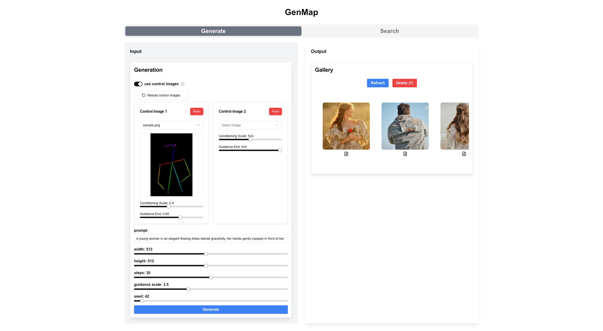

# 🗺️ GenMap

**GenMap** is an interactive web application for exploring, generating, and understanding AI-generated images through embedding-based maps.  
It integrates *semantic search*, *condition-controlled generation*, and *visual mapping* into a seamless research and creative tool.



## 🚀 Features

### 🔍 Semantic Search (Text & Image)
- Search by **text prompts** or **reference images**
- Uses **image embedding space** (CLIP-based) for high-accuracy similarity matching

### 🎨 Controlled Image Generation
- Support for **ControlNet** to condition generation with:
  - Pose / Edge / Depth / Segmentation
- Combine prompt, structure, and style for precise control

### 🧠 Embedding Map Visualization (Coming Soon)
- Each image is mapped into a **2D semantic space**
- Explore clusters, discover hidden connections, and visually browse by meaning
- Built with **Qdrant**, **UMAP/t-SNE**, and **interactive frontend UI**

### 💾 Lightweight & Local
- All data stored locally
  - Image files on disk
  - Metadata in **SQLite**
  - Embeddings indexed in **Qdrant**
- Ideal for **research**, **experiments**, or **personal dataset curation**

## 🧱 Tech Stack

| Layer | Technology |
|-------|------------|
| Frontend | Next.js (React) |
| Backend | FastAPI (Python) |
| Image Storage | Local filesystem |
| Metadata DB | SQLite + SQLAlchemy |
| Embedding Index | Qdrant |
| Embedding Model | CLIP (via 🤗 Transformers or OpenCLIP) |
| Optional Gen | ControlNet + Stable Diffusion backend (Flux.1) |

## 🗂️ Project Structure
```plaintext
genmap/
├── backend/             # FastAPI backend
│   ├── app/             # FastAPI app
│   ├── models/          # Pydantic models
│   ├── services/        # Business logic
│   ├── utils/           # Utility functions
│   ├── main.py          # Entry point
│   └── requirements.txt # Python dependencies
├── frontend/            # Next.js frontend
│   ├── public/          # Static assets
│   ├── src/             # React components
│   ├── pages/           # Next.js pages
│   ├── styles/          # CSS styles
│   ├── utils/           # Utility functions
│   └── package.json     # Node.js dependencies
├── data/                # Data storage
│   ├── images/          # Image files
│   ├── metadata.db      # SQLite database
│   └── embeddings/      # Qdrant index files
├── scripts/             # Utility scripts (e.g., indexing, UMAP)
├── assets/              # Assets for documentation
└── README.md            # Project documentation
```

## 🛠️ Getting Started

### 1. Clone the repository
```bash
git clone https://github.com/kengo-ut/genmap.git
cd genmap
```

### 2. Set backend
```bash
cd backend
```

#### Install dependencies
```bash
uv sync
```

#### Set env
Create a `.envrc` file and set the Python path (full path to the backend directory).

```
export PYTHONPATH=/xxxxx/backend
```

#### Run
```bash
make dev
```

### 3. Set frontend
```bash
cd frontend
```

#### Install dependencies
```bash
volta install
yarn
```

#### Set env
Create a `.env.local` file and set the below url.

```
NEXT_PUBLIC_API_BASE_URL=http://127.0.0.1:8000
```

#### Place data
Create a `public/data/control_images` directory and place control images (canny, soft edge, depth, pose, or gray) used for controlling image generation in it.

#### Run
```bash
yarn dev
```

### 4. Access the application
Open your browser and navigate to [http://localhost:3000](http://localhost:3000).

## 🧩 Use Cases
- Prompt-based image dataset analysis
- Visual exploration of generation trends
- Pose- or structure-guided image generation (via ControlNet)
- Internal tool for creative research or model fine-tuning

## 📜 License
This project is licensed under the MIT License. See the [LICENSE](./LICENSE) file for details.

## 🙏 Acknowledgements
- [openai/clip-vit-base-patch32](https://huggingface.co/openai/clip-vit-base-patch32)
- [black-forest-labs/FLUX.1-dev](https://huggingface.co/black-forest-labs/FLUX.1-dev)
- [Shakker-Labs/FLUX.1-dev-ControlNet-Union-Pro-2.0](https://huggingface.co/Shakker-Labs/FLUX.1-dev-ControlNet-Union-Pro-2.0)

## 💬 TODO
- [x] ControlNet-based generation UI
- [ ] UMAP-powered image map viewer
- [ ] Multi-image generation
